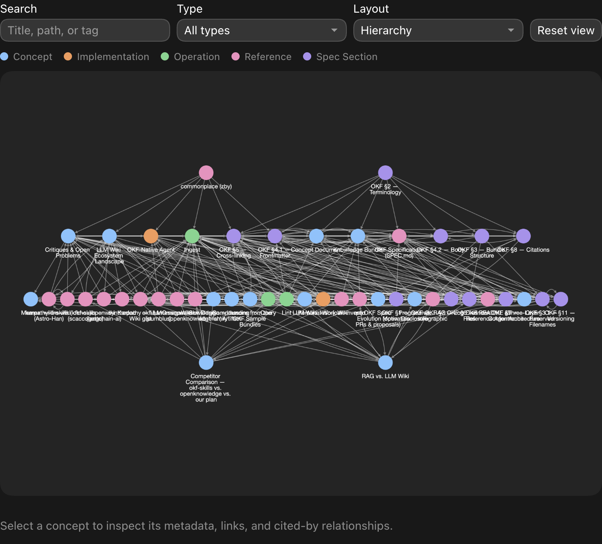

# agent-knowledge

**Give your coding agent a knowledge base that gets better over time.**

`agent-knowledge` turns project documents, decisions, notes, and conversations into a portable
Markdown wiki that your agent maintains for you. Ask a question and get a cited answer. Add a source
and the agent integrates it with what the project already knows. Run a health check and it finds
stale claims, contradictions, and orphaned pages before the wiki quietly rots.

Everything stays in your repository as plain Markdown + Git: readable without special tooling,
diffable in code review, and portable across agents.

## Install

Via [skills.sh](https://skills.sh) for Claude Code, Cursor, Codex, and 20+ other agents:

```bash
npx skills@latest add stjbrown/agent-knowledge
```

Or install it as a Claude Code plugin:

```text
/plugin marketplace add stjbrown/agent-knowledge
/plugin install agent-knowledge
```

## See it work

Start a knowledge base in any project:

```text
/kb-init
```

Then use ordinary prompts:

```text
Ingest this architecture decision: we chose Postgres because...

What do we know about authentication, and which sources support it?

What conflicts with our current deployment strategy?
```

The agent extracts durable knowledge, connects it to existing concepts, answers with citations, and
files valuable new conclusions back into the bundle. Two explicit commands handle maintenance:

```text
/kb-lint       # find broken links, stale claims, contradictions, and gaps
/kb-visualize  # explore the bundle as an interactive graph
```



The [`knowledge/`](./knowledge/) directory is a complete working example. It documents this project
using the same format and skills the project provides.

## Why this exists

Most agent "memory" is either retrieval over raw documents or a pile of notes that nobody maintains.
The first repeatedly re-derives answers; the second gradually becomes untrustworthy. Neither makes
knowledge stewardship an explicit job.

The hard part of a useful knowledge base is the bookkeeping: integrating new information, updating
cross-references, preserving provenance, flagging contradictions, and keeping summaries current.
That is exactly the work an agent can perform consistently.

`agent-knowledge` makes the agent a disciplined **wiki maintainer**:

- **Ingest** a source once → the agent extracts the signal and integrates it across the bundle.
- **Query** the bundle → it navigates by links, answers with citations, and files good answers back.
- **Lint** it → it catches drift (contradictions, stale claims, orphans) before the base rots.

Two design choices keep the result portable and trustworthy:

- **A real, open format.** Bundles follow Google's
  [Open Knowledge Format (OKF)](https://github.com/GoogleCloudPlatform/knowledge-catalog/tree/main/okf)
  rather than a tool-specific database or hidden memory store.
- **An explicit trust model.** Meaning is append-only: the agent supersedes claims with provenance
  instead of silently rewriting history.

The workflow is based on Andrej Karpathy's
[LLM Wiki](https://gist.github.com/karpathy/442a6bf555914893e9891c11519de94f) pattern, made conformant
to OKF and packaged as skills you can drop into any project.

## The skills

The family splits on **who invokes them**. **Model-invoked** skills the agent can reach for on its
own when the task fits; **user-invoked** skills you trigger deliberately by name.

**Model-invoked**

- **`kb`** — the hub. Explains the format, holds the shared spec / glossary / trust model /
  templates, and routes to the right skill. Other `kb-*` skills read its reference as their single
  source of truth.
- **`kb-ingest`** — read a raw source once, extract its signal, and integrate it across the bundle
  under the trust model. The heart of the system.
- **`kb-query`** — answer a question from the bundle (or surface relevant context for another task)
  by progressive disclosure, cite the concepts used, and file valuable answers back so the base
  compounds.

**User-invoked**

- **`kb-init`** — scaffold a new bundle (default `knowledge/`, custom path, multi-bundle aware) and
  write its per-project schema layer (concept types + conventions) so the generic skills fit your
  domain.
- **`kb-lint`** — health-check the bundle: a deterministic OKF conformance pass plus a drift audit
  (contradictions, stale claims, orphans, coverage gaps), with an optional safe `fix` mode.
- **`kb-visualize`** — render the bundle as an interactive graph — native UI where the host supports
  it, otherwise a self-contained HTML file.

## This repo documents itself in OKF

The [`knowledge/`](./knowledge/) directory is a **conformant OKF bundle about OKF and the LLM Wiki
pattern** — so the repository is its own worked example. Browse it to see what a bundle looks like,
or open [`knowledge/viz.html`](./knowledge/viz.html) for the interactive graph. Start at
[`knowledge/index.md`](./knowledge/index.md).

## Layout

```
skills/
  kb/                 # hub: SKILL.md + references/ (SPEC, glossary, trust-model) + templates/ + example-bundle/
  kb-init/  kb-ingest/  kb-query/
  kb-lint/            # + scripts/conformance.py  (deterministic §9 check, no deps)
  kb-visualize/       # + scripts/graph.py        (graph-model extractor, no deps)
knowledge/            # this project's own OKF bundle (self-documenting) + viz.html
.claude-plugin/       # plugin manifest
```

## License

[MIT](./LICENSE). The vendored OKF specification (`skills/kb/references/SPEC.md`) is from
GoogleCloudPlatform/knowledge-catalog under Apache-2.0; see [NOTICE](./NOTICE).
